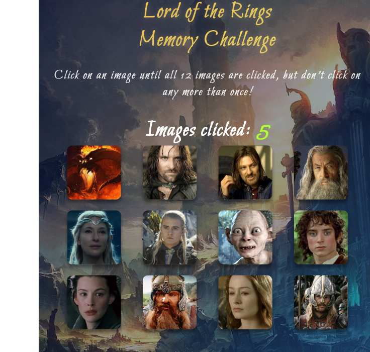

<h1 align="center">Lord of the Rings Memory Challenge ⚔️ </h1>
<p>
  
  
  
</p>

> This is a memory game created with React. Players must click each image just once and be able to remembered the clicked image. If an image is clicked twice, the score is reset to zero. Players must reach the score of 12.

### ✨ [Demo](https://react-click-game.web.app/)

## Prerequisites

- npm >=5.5.0
- node >=9.3.0

## Install

```sh
npm install
```

## Usage

```sh
npm run start
```

## Built With

* [React](https://www.npmjs.com/package/react) - React is a JavaScript library for creating user interfaces.

## Screenshot


## Author

👤 **Elmer C. Galo**

* Website: https://github.com/galoelmer

## 🤝 Contributing

Contributions, issues and feature requests are welcome!<br />

## Show your support

Give a ⭐️ if this project helped you!

## 📝 License

Copyright © 2019 [Elmer C. Galo](https://github.com/galoelmer).<br />
This project is [MIT](https://github.com/kefranabg/readme-md-generator/blob/master/LICENSE) licensed.

